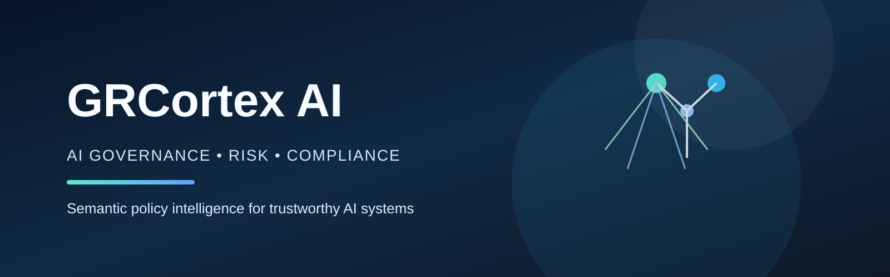
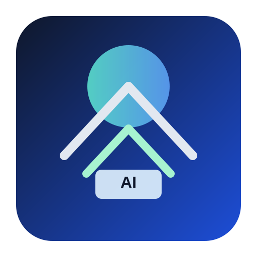

# GRCortex AI Demo

<p align="center">
  
</p>

<p align="center">
  
</p>

GRCortex AI is a lightweight end-to-end governance, risk, and compliance intelligence prototype for AI systems. It demonstrates how semantic policy mapping, graph-based AI asset controls, and real-time telemetry evaluation can be combined into a single operational workflow for AI governance.

## Overview

The project is structured into three layers:

1. Knowledge Graph Layer: asset-to-control mapping using NetworkX.
2. Vector Policy Layer: semantic risk matching using sentence-transformers and cosine similarity.
3. Telemetry Layer: FastAPI compliance hook that evaluates drift, bias, and hallucination risk in real time.

## Why this matters

Modern AI governance needs to shift from annual reviews to continuous risk monitoring. GRCortex AI brings together technical observability and regulatory control logic so organizations can identify and respond to governance failures quickly instead of discovering them only during audits.

## Architecture

- AI asset registry and control graph in `database/knowledge_graph.py`
- Vector policy matching in `intelligence/vector_matcher.py`
- Real-time telemetry compliance evaluation in `monitoring/telemetry_engine.py`
- Demo orchestration in `main.py`

## Getting started

```bash
python -m venv .venv
.\.venv\Scripts\activate
pip install -r requirements.txt
python main.py
```

## API endpoint

The telemetry service exposes:

```http
POST /v1/grc/telemetry-hook
```

Example payload:

```json
{
  "asset_id": "mod_01",
  "drift_score": 0.10,
  "bias_disparity_index": 0.02,
  "hallucination_rate": 0.01
}
```

## Documentation

- [Project Documentation](docs/project-documentation.md)
- [Medium.com Thesis Draft](docs/medium-thesis.md)
- [Copyright Notice](docs/copyright.md)

## Copyright

Copyright © 2026 Devesh Kumar. All rights reserved.
Contact: devesh2178@gmail.com

## License

This project is provided for demonstration, research, and educational purposes. Please review all usage constraints before production deployment or redistribution.
