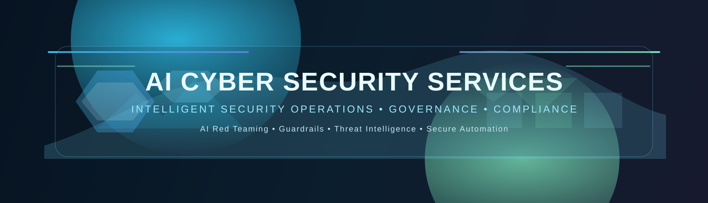
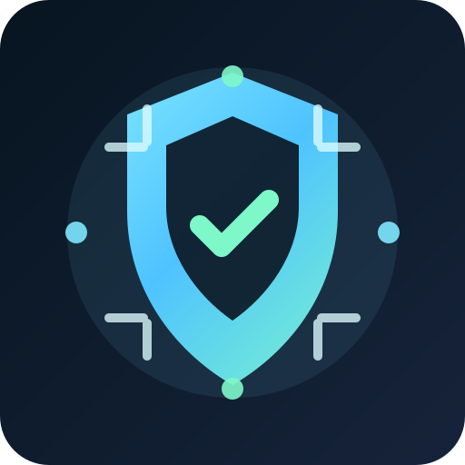

<p align="center">
  
</p>

<p align="center">
  
</p>

# AI Cyber Security Services

Copyright © 2026 Devesh Kumar  
Email: devesh2178@gmail.com

AI Cyber Security Services is a unified portfolio of AI safety, governance, compliance, and security operations prototypes designed to demonstrate how large language models and intelligent automation can be governed, inspected, and operationalized safely in enterprise environments.

This product combines four related solution streams:

- BU-001: AI Security Demo — dual-LLM isolation, deterministic guardrails, and semantic scanning
- BU-002: HexaShield AI Simulation — AI red teaming, risk taxonomies, adversarial scenario simulation, and governance workflows
- BU-003: GRCortex AI Demo — governance, risk, and compliance intelligence with semantic policy mapping and telemetry scoring
- BU-004: CyberTiX AI — evidence-bound SOC operations, threat triage, MITRE-aligned reasoning, and policy enforcement

## Product vision

Modern organizations are adopting generative AI rapidly, but the real challenge is not just capability—it is operational trust. AI Cyber Security Services addresses this challenge by combining:

- AI red teaming and threat simulation
- deterministic and semantic guardrails
- governance and policy mapping
- compliance risk analysis
- evidence-based security operations
- model assurance and human review controls

## Value proposition

This portfolio is intended for:

- security strategy workshops
- AI governance pilot programs
- compliance readiness demonstrations
- red-team assessment exercises
- research and educational prototyping
- enterprise AI assurance concept validation

## Solution architecture

The combined system models a layered AI security fabric:

1. Input and telemetry intake
2. Adversarial scenario generation and evaluation
3. Guardrail enforcement and containment logic
4. Security policy and compliance alignment
5. Human-in-the-loop review and governance escalation
6. Evidence-driven operational decision-making

## Repository structure

The repository is now checked in as a single Git project with the four delivery folders included directly in the root. Each solution folder contains its own source, tests, docs, and runtime assets.

```text
AI-Cyber-Security-Services/
├── README.md
├── LICENSE
├── .gitignore
├── .github/
│   └── assets/
│       ├── header-banner.svg
│       └── product-icon.svg
├── docs/
│   ├── COMPLIANCE_CHECKLIST.md
│   ├── COMPLIANCE.md
│   ├── COPYRIGHT.md
│   ├── PATENT_AND_INVENTION_DISCLOSURE.md
│   ├── SCOPE_OF_WORK.md
│   ├── FUTURE_ENHANCEMENTS.md
│   ├── RFP.md
│   └── MEDIUM_THESIS.md
├── BU-001-ai_security_demo/
│   ├── main.py
│   ├── main2.py
│   ├── README.md
│   ├── requirements.txt
│   ├── docs/
│   ├── security/
│   └── tests/
├── BU-002-hexashield-sim/
│   ├── main.py
│   ├── README.md
│   ├── requirements.txt
│   ├── modules/
│   ├── docs/
│   ├── tests/
│   └── output.txt
├── BU-003-grcortex-ai-demo/
│   ├── main.py
│   ├── README.md
│   ├── requirements.txt
│   ├── database/
│   ├── intelligence/
│   ├── monitoring/
│   ├── docs/
│   └── test/
├── BU-004-CyberTiX AI-Semantic Large Security Model-demo/
│   ├── main.py
│   ├── README.md
│   ├── requirements.txt
│   ├── engine.py
│   ├── models.py
│   ├── docs/
│   ├── tests/
│   └── output.txt
└── .git/
```

## Product modules and implementations

### 1. BU-001 AI Security Demo

Focus: dual-LLM security pipeline, safe execution boundaries, guardrails.

Features include:

- untrusted extractor and trusted executor split
- regex-based deterministic policy checks
- semantic safety scanning across outputs
- demonstration of AI control planes for safe execution

### 2. BU-002 HexaShield AI Simulation

Focus: AI red-team simulation and governance modeling.

Features include:

- adversarial scenario generation
- risk taxonomy mapping
- model evaluation simulation
- issue severity and governance routing

### 3. BU-003 GRCortex AI Demo

Focus: governance, risk, and compliance intelligence.

Features include:

- knowledge graph mapping of controls and assets
- vector similarity based policy matching
- telemetry hook for drift, bias, and hallucination risk
- continuous compliance evaluation workflow

### 4. BU-004 CyberTiX AI

Focus: evidence-bound security operations workflow.

Features include:

- normalized event intelligence
- evidence bundle generation
- MITRE-aligned threat reasoning
- policy-gated remediation decisions

## Quick start

### Option 1: Review the consolidated product documentation

Read the governance and product documentation in the `docs/` folder:

- [Compliance Checklist](docs/COMPLIANCE_CHECKLIST.md)
- [Compliance Document](docs/COMPLIANCE.md)
- [Copyright Document](docs/COPYRIGHT.md)
- [Patent and Invention Disclosure](docs/PATENT_AND_INVENTION_DISCLOSURE.md)
- [Scope of Work](docs/SCOPE_OF_WORK.md)
- [Future Enhancements](docs/FUTURE_ENHANCEMENTS.md)
- [RFP Proposal](docs/RFP.md)
- [Medium.com Publishable Thesis](docs/MEDIUM_THESIS.md)

### Option 2: Run individual demo components

Each BU folder is a standalone project that contains its own README, requirements, and runtime entry point. Use the project folders directly for local execution and validation:

- [BU-001-ai_security_demo](BU-001-ai_security_demo)
- [BU-002-hexashield-sim](BU-002-hexashield-sim)
- [BU-003-grcortex-ai-demo](BU-003-grcortex-ai-demo)
- [BU-004-CyberTiX AI-Semantic Large Security Model-demo](BU-004-CyberTiX%20AI-Semantic%20Large%20Security%20Model-demo)

### Option 3: Use the root repository as the consolidated product

The root README acts as the master overview for the full portfolio. Use it to navigate across all solution streams while keeping the individual directories intact for specific demos and engineering work.

## Compliance and governance posture

This product is designed as a research-and-demo security portfolio and should be treated as a conceptual prototype unless hardened for production deployment. The documentation set includes explicit controls for:

- governance readiness
- evidence traceability
- policy mapping
- user review automation boundaries
- operational risk classification

## Documentation set

The project includes the following foundational documentation:

- [Compliance Checklist](docs/COMPLIANCE_CHECKLIST.md)
- [Compliance Document](docs/COMPLIANCE.md)
- [Copyright Document](docs/COPYRIGHT.md)
- [Patent and Invention Disclosure](docs/PATENT_AND_INVENTION_DISCLOSURE.md)
- [Scope of Work](docs/SCOPE_OF_WORK.md)
- [Future Enhancements](docs/FUTURE_ENHANCEMENTS.md)
- [Request for Proposal (RfP)](docs/RFP.md)
- [Medium.com Publishable Thesis](docs/MEDIUM_THESIS.md)

## Product ownership and contact

- Author: Devesh Kumar
- Email: devesh2178@gmail.com
- GitHub: https://github.com/Deveshk78/AI-Cyber-Security-Services

## Status

This repository represents a combined security research and demonstration portfolio for AI assurance, governance, and compliance operations. It is intended for educational, conceptual, and commercial-prototyping use under the included documentation and rights notice.

---

This product is a research-oriented prototype and not a substitute for production-grade security controls, legal review, or enterprise deployment governance.
